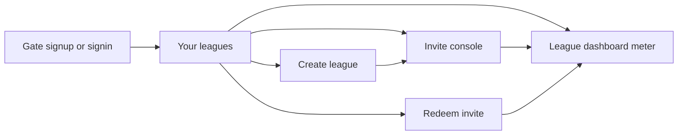

# Chuckle Fantasy — App SDD

**Role:** Spec for the **multi-league app path** (account → league home → invites → dashboard).
Companion to the meter canon [`PRODUCT.md`](PRODUCT.md). Votes wire: [`VOTES_SDD.md`](VOTES_SDD.md).
News / smack: [`NEWS_SDD.md`](NEWS_SDD.md) / [`SMACK_AGENT.md`](SMACK_AGENT.md). Domain: [`CUSTOM_DOMAIN.md`](CUSTOM_DOMAIN.md).
**Build today:** [`DESKTOP_CHECKLIST.md`](DESKTOP_CHECKLIST.md).

**Status:** Implemented on branch `cursor/multi-league-app-878c` (PR #44). Live when SQL + Edge Function are applied and dogfood passes.

**App name:** Chuckle Fantasy (brand in shell). Hosted league one: **CuckleChunckle** (`1315431339301806080`).

---

## 1. Problem

The trade meter started as a single-league static site. Managers need:

1. A real account (one person, one vote).
2. A way to join **their** Sleeper seat without typing Sleeper user IDs or passwords.
3. A home that can hold **many** leagues later, with Cuckle working first.

Sleeper’s API is **read-only and has no OAuth**. Collecting Sleeper passwords is out. Seat binding is done with **commissioner-minted, seat-specific invite codes**.

---

## 2. Product shape (locked)

```text
Commissioner
  ├─ Create account (username + password)
  ├─ Create a league → Sleeper league ID (+ optional ESPN league ID)
  ├─ App GETs Sleeper roster → one CF- invite per owned seat
  ├─ Invite console: copy codes, rotate unclaimed, claim own seat
  └─ Home: leagues created + seats claimed

Member
  ├─ Create account (username + password only — no platform IDs)
  ├─ Redeem CF-XXXX-XXXX
  └─ Dashboard for that seat (Teams auto-selected when possible)
```

**Seat identity:** Sleeper roster `user_id` + team name on create. Invite hash stores that binding. Member never enters a Sleeper ID.

**ESPN:** `espn_league_id` optional on create — **stored only**. First ship syncs **Sleeper**. History import is PARKED.

**Out:** Sleeper chat scrape, Sleeper passwords, Phase 1 `CUCK-` seat seeding, client self-insert into `league_memberships`.

---

## 3. Screens and flows



| Screen | Purpose | Key actions |
| --- | --- | --- |
| **Gate** | Account | Create account / Sign in |
| **Your leagues** | Home | Open dash, Manage invites, Create, Redeem |
| **Create a league** | Commissioner | Sleeper league ID + optional ESPN → mint or reopen console |
| **Invite console** | Commissioner | Codes (once), Rotate unclaimed, Claim this seat, Open dash |
| **Redeem invite** | Member | Enter `CF-…` → membership → dash |
| **Dashboard** | Meter | Existing Cuckle UI; vote as membership seat |

### Happy paths

**A. Commissioner (first time)**  
Sign up → Create league `1315431339301806080` → see 10 codes → DM each manager → **Claim this seat** for own team → Open dashboard → vote.

**B. Member**  
Sign up → Redeem code → dashboard with that seat → vote.

**C. Commissioner revisit**  
Create again with same ID → **no remint** → invite console (status only) → Rotate only if a code was lost.

---

## 4. Data model

| Table / artifact | Purpose |
| --- | --- |
| `auth.users` + `app_profiles` | Username; synthetic email `{username}@users.cuckle.invalid` |
| `leagues` | `sleeper_league_id`, name, status (`pending_sync` \| `ready` \| `error`), `created_by`, optional `espn_league_id`, `synced_at` |
| `seat_invites` | One row per `(league, sleeper_user_id)`; `code_hash`; `claimed_by` |
| `league_memberships` | Auth user ↔ seat in a league (unique per user/league and per seat/league) |
| `trade_votes` | Ballot + **`sleeper_league_id`**; voter forced from membership |
| `seat_profiles` | Legacy Phase 1 bridge; **not** vote source of truth after Wave 2 |
| `data/leagues/<id>/ui/*` | Per-league meter JSON |
| `data/ui/*` | Cuckle dual-write / news-refresh |

### Identity rules

1. One Auth user may join many leagues.
2. One Sleeper seat per league may be claimed by only one Auth user.
3. Vote `voter` = that league’s membership `sleeper_user_id` (DB trigger + RLS).
4. Leaving a league (delete membership) stops new votes for that league; historical ballots stay.

---

## 5. Edge Function `join-league`

Source: [`supabase/functions/join-league/index.ts`](../supabase/functions/join-league/index.ts).  
Auth: caller JWT required. Writes: **service role** only (clients cannot insert leagues/memberships/invites).

| `action` | Who | Behavior |
| --- | --- | --- |
| `preview` | Signed-in | Sleeper roster preview |
| `create` | Commissioner | First claim of `created_by`: upsert league + mint codes. Same commissioner again: `already_exists` + status list (**no remint**) |
| `list_invites` | Creator | Claimed / unclaimed; no plaintext codes |
| `rotate_invites` | Creator | New codes for **unclaimed** seats only |
| `redeem` | Member | RPC `redeem_seat_invite` — atomic membership + claim |
| `claim_seat` | Creator | RPC `claim_commissioner_seat` — consume own seat invite |

Invite format: `CF-XXXX-XXXX` (SHA-256 stored). Shown **once** after mint/rotate.

---

## 6. Client (app shell)

Owned by [`generate-page.mjs`](../generate-page.mjs) → `index.html`.

| Concern | Behavior |
| --- | --- |
| Session | `localStorage` Auth tokens + active league + memberships cache |
| Home list | `league_memberships` ∪ `leagues.created_by = me` |
| Data load | Prefer `data/leagues/<id>/ui/…`; Cuckle falls back to `data/ui/` |
| Pending | Non-Cuckle + `status ≠ ready` + no book → pending banner |
| Vote write | JWT + `sleeper_league_id` + seat; DB rewrites `voter` |
| Teams | On open dash, auto-`selectMe` when membership matches a member |

Dead paths removed: platform-ID signup, Phase 1 CUCK claim UI, open client membership insert.

---

## 7. Meter pipeline (multi-league)

```text
node build.mjs [league_id]
  sleeper-sync → draft-resolve → value-snapshot (shared)
  → revalue → title-path → apply-value-adjust
  → generate-page (Cuckle only)
  → mark-league-ready (if service role set)
```

| Path | Role |
| --- | --- |
| `data/leagues/<id>/raw/` | League tape |
| `data/leagues/<id>/ui/` | Dashboard JSON |
| `data/ui/` | Cuckle dual-write |
| Shared | `value_curve`, `players.nfl`, `ktc/`, `tx_cache/` |

Action: [`.github/workflows/league-sync.yml`](../.github/workflows/league-sync.yml).

Cuckle is seeded / forced `ready` so the existing book works before a second-league sync.

---

## 8. SQL apply order

1. [`db/phase1-seat-auth.sql`](../db/phase1-seat-auth.sql) — vote write gate + `seat_profiles`
2. [`db/multi-league-app.sql`](../db/multi-league-app.sql) — profiles, leagues, memberships, Cuckle seed
3. [`db/commissioner-invites.sql`](../db/commissioner-invites.sql) — invites, optional platform IDs
4. [`db/wave1-invite-hardening.sql`](../db/wave1-invite-hardening.sql) — redeem/claim RPCs, tighten RLS
5. [`db/wave2-vote-identity.sql`](../db/wave2-vote-identity.sql) — per-league votes

Do **not** run [`seed-seat-auth.mjs`](../seed-seat-auth.mjs) (retired).

---

## 9. Failure modes (expected behavior)

| Case | Behavior |
| --- | --- |
| Second commissioner on same league | 409 |
| Reuse claimed invite | 409 |
| Redeem race | Atomic RPC — one winner |
| Remint on create revisit | Forbidden — use Rotate |
| Commissioner never claims seat | League on home as commissioner-only; no meter until claim/redeem |
| Vacant roster / no Sleeper user | No invite for that slot; console shows minted vs `total_rosters` |
| Vote without membership | Trigger/RLS reject |
| Non-Cuckle before build | `pending_sync` screen until `build.mjs` + ready |
| Wrong Site URL / Confirm email ON | Signup/session breaks — fix Auth settings |

---

## 10. Security

- Confirm email **OFF** (synthetic emails never mailed).
- Invite codes are secrets — DM out of band; never commit.
- `code_hash` only in DB; plaintext only after mint/rotate in the creator’s browser.
- League / membership / invite writes: service role / Edge only.
- Vote tallies publicly readable; writes authenticated + membership-scoped.
- Anon key in the page is not a secret; RLS is the boundary.

---

## 11. Non-goals / PARKED

| Item | Status |
| --- | --- |
| Sleeper chat / comments scrape | **No** — no public API; privacy/ToS |
| ESPN meter import | PARKED (`espn_league_id` reserved) |
| Web push / App Store | PARKED — custom domain + PWA install first |
| Auto-sync every league on create | Manual / Action `league-sync` for now |
| Smack agent seat-voice bank | Future opt-in inside Chuckle — not Sleeper scrape |

---

## 12. Acceptance (Cuckle + path ready)

- [ ] SQL 1–5 applied; `join-league` deployed; Confirm email OFF
- [ ] Commissioner creates Cuckle once; revisit opens console without remint
- [ ] Ten codes DMed; commissioner claims own seat; member redeems
- [ ] Both can open dashboard and cast a vote as their seat
- [ ] Second league can be registered; meter appears only after scoped build → `ready`

---

## 13. File map

| Path | Role |
| --- | --- |
| [`generate-page.mjs`](../generate-page.mjs) / `index.html` | App shell + meter |
| [`supabase/functions/join-league/index.ts`](../supabase/functions/join-league/index.ts) | Create / invites / redeem |
| [`db/wave1-invite-hardening.sql`](../db/wave1-invite-hardening.sql) | Atomic redeem / claim / RLS |
| [`db/wave2-vote-identity.sql`](../db/wave2-vote-identity.sql) | Per-league votes |
| [`build.mjs`](../build.mjs) / [`lib.mjs`](../lib.mjs) | Scoped pipeline |
| [`mark-league-ready.mjs`](../mark-league-ready.mjs) | Status flip |
| [`DESKTOP_CHECKLIST.md`](DESKTOP_CHECKLIST.md) | Same-day operator path |
