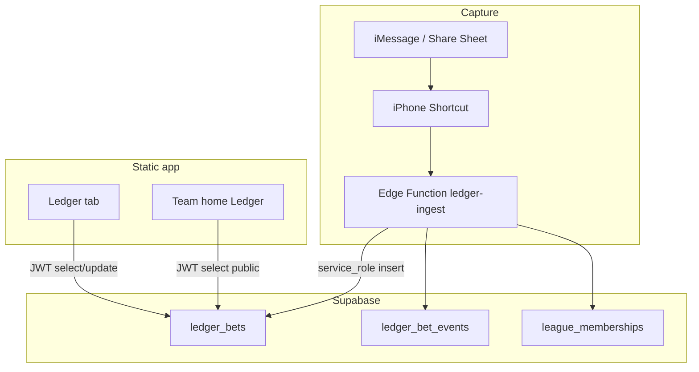

# Ledger buildout SDD (implementer’s runbook)

**Status:** App UI + SQL + Edge Function are on `main`. This document is the
**buildout / go-live SDD** — what to run in Supabase and on your phone so live
Ledger works end-to-end.

| Artifact | Role |
| --- | --- |
| [`LEDGER_SDD.md`](LEDGER_SDD.md) | Product rules (canonical) |
| [`plans/ledger_and_league_tab.md`](plans/ledger_and_league_tab.md) | Shipped plan: League tab + Ledger v1 |
| [`plans/ledger_privacy_views.md`](plans/ledger_privacy_views.md) | Shipped plan: my slips, privacy, team W/L |
| **This file** | Architecture + ordered implementation steps |

---

## 1. Goal

Ship a Tip-Slip–style bet Ledger for Chuckle Fantasy:

1. **League** leftmost tab (Latest trade) — already shipped.
2. **Ledger** tab — my slips only; Accept / Decline / Cancel / Settle; Public/Private.
3. **Team home** — that seat’s public W/L money + public slips.
4. **Capture path** — iPhone Shortcut → Edge Function `ledger-ingest` → `ledger_bets`.

---

## 2. Architecture



| Layer | Responsibility |
| --- | --- |
| SQL wave12 | Tables, status machine, party UPDATE RLS, expire RPC |
| SQL wave13 | `visibility`, SELECT = member AND (party OR public) |
| `ledger-ingest` | Secret-gated Shortcut POST; name resolve; idempotent insert |
| App (JWT) | Read/patch own slips; team page reads public slips |

**Project URL:** `https://gtqyvnkkjiksmmtmzubw.supabase.co`  
**Function URL (after deploy):**  
`https://gtqyvnkkjiksmmtmzubw.supabase.co/functions/v1/ledger-ingest`

---

## 3. Repo map (already on `main`)

| Path | What |
| --- | --- |
| [`db/wave12-ledger.sql`](../db/wave12-ledger.sql) | Schema + RLS + `ledger_expire_proposed` |
| [`db/wave13-ledger-visibility.sql`](../db/wave13-ledger-visibility.sql) | Privacy column + SELECT tighten |
| [`supabase/functions/ledger-ingest/index.ts`](../supabase/functions/ledger-ingest/index.ts) | Shortcut ingest |
| [`generate-page.mjs`](../generate-page.mjs) | `renderLedger`, team Ledger, visibility toggle |
| Design Mode | Seed slips so UI is demoable without SQL |

You do **not** need to rewrite app code to go live — only Supabase + Shortcut.

---

## 4. Data model (summary)

### `ledger_bets`

Key columns: `sleeper_league_id`, `title`, `terms`, `odds`, `amount_cents`,
`side_a` / `side_b` (Sleeper user ids), `proposer`, `status`, `side_a_lock` /
`side_b_lock`, `deadline_at`, `winner`, `visibility` (`public`\|`private`),
`source`, `raw_hash`.

### Status machine

```
proposed → open          (both locks true)
proposed → declined | canceled | expired
open → settled | canceled (admin later)
```

### Visibility

| Value | Who can SELECT |
| --- | --- |
| `public` (default) | Any league member |
| `private` | Only `side_a` / `side_b` |

Own Ledger tab **client-filters** to slips where you are a party (even if RLS also
returns other members’ public slips).

---

## 5. Acceptance criteria (go-live done when)

- [ ] wave12 + wave13 ran without error in SQL Editor
- [ ] `ledger_bets` / `ledger_bet_events` exist; `visibility` column present
- [ ] `ledger-ingest` deployed; `LEDGER_INGEST_SECRET` set
- [ ] curl smoke test returns `{ "ok": true, "bet_id": "…" }`
- [ ] Signed-in member sees that slip on **Ledger** (My slips)
- [ ] Counterparty can Accept → status `open`
- [ ] Either party can toggle Private; other members do **not** see it on team home
- [ ] Team home for a seat shows public Taken from / Lost to / Bets lost when settled public slips exist
- [ ] Design Mode still shows seeded slips without Supabase

---

## 6. Implementation steps (operator)

Do these in order. Times are wall-clock, not estimates of engineering work.

### Step 0 — Confirm you are on latest `main`

```bash
git checkout main
git pull origin main
```

Live site: https://slabslip.github.io/cuckle-trade-tracker/  
Hard-refresh after Pages deploys (or wait ~1–2 minutes after merge).

### Step 1 — Run wave12 SQL

1. Open [Supabase SQL Editor](https://supabase.com/dashboard/project/gtqyvnkkjiksmmtmzubw/sql).
2. Open repo file `db/wave12-ledger.sql` → copy all → paste → **Run**.
3. Confirm success (no red error). Tables `ledger_bets` and `ledger_bet_events` appear under **Table Editor**.

### Step 2 — Run wave13 SQL

1. Same SQL Editor.
2. Paste all of `db/wave13-ledger-visibility.sql` → **Run**.
3. Confirm `ledger_bets` has a `visibility` column (default `public`).

### Step 3 — Create ingest secret

1. Generate a long secret, e.g. macOS Terminal:

```bash
openssl rand -hex 32
```

2. Save it somewhere private (you will paste it into Supabase **and** the Shortcut).

### Step 4 — Set Edge Function secret

1. Supabase → **Project Settings** → **Edge Functions** → **Secrets**  
   (or CLI: `supabase secrets set LEDGER_INGEST_SECRET='…'`).
2. Add:
   - Name: `LEDGER_INGEST_SECRET`
   - Value: the string from Step 3  
   (`SUPABASE_URL` and `SUPABASE_SERVICE_ROLE_KEY` are already injected for hosted functions.)

### Step 5 — Deploy `ledger-ingest`

**Option A — CLI (from repo root)**

```bash
# Once: https://supabase.com/dashboard/account/tokens
export SUPABASE_ACCESS_TOKEN='sbp_…'
npx supabase login --token "$SUPABASE_ACCESS_TOKEN"
npx supabase link --project-ref gtqyvnkkjiksmmtmzubw
npx supabase functions deploy ledger-ingest --no-verify-jwt
```

`--no-verify-jwt` is correct for Shortcut calls that use the shared secret header
(not a user JWT). The function still checks `x-ledger-secret`.

**Option B — Dashboard**

1. Edge Functions → Create / Deploy.
2. Upload or sync `supabase/functions/ledger-ingest/index.ts`.
3. Disable “Verify JWT” if the Dashboard exposes that toggle (secret header is the gate).

### Step 6 — Smoke-test with curl

Replace `YOUR_SECRET` and `YOUR_ANON_KEY` (Settings → API → `anon` `public`):

```bash
curl -sS -X POST \
  'https://gtqyvnkkjiksmmtmzubw.supabase.co/functions/v1/ledger-ingest' \
  -H 'Content-Type: application/json' \
  -H 'apikey: YOUR_ANON_KEY' \
  -H 'Authorization: Bearer YOUR_ANON_KEY' \
  -H 'x-ledger-secret: YOUR_SECRET' \
  -d '{
    "sleeper_league_id": "1315431339301806080",
    "submitted_by": "TrumanCooper",
    "raw_text": "Truman vs Sam — Stribling SF WR1 — $100 even — ends Dec 18, 2026",
    "title": "Stribling will finish the season as SF WR1",
    "amount": 100,
    "odds": "even",
    "side_a_name": "Truman",
    "side_b_name": "Sam",
    "deadline": "2026-12-18",
    "visibility": "public"
  }'
```

Expect:

```json
{ "ok": true, "bet_id": "…", "status": "proposed", "deduped": false }
```

| Result | Meaning |
| --- | --- |
| `401 unauthorized` | Secret mismatch / header name wrong (`x-ledger-secret`) |
| `422` / `needs_review` | Name did not resolve uniquely — use exact team names from memberships |
| `500 LEDGER_INGEST_SECRET missing` | Secret not set on the function |

### Step 7 — Build the iPhone Shortcut

1. Shortcuts app → **+** → name it e.g. **Chuckle Ledger**.
2. **Receive** → Text (or Share Sheet).
3. Optional **Ask for Input** for title / amount / names / deadline.
4. **Get Contents of URL**:
   - Method: **POST**
   - URL: `https://gtqyvnkkjiksmmtmzubw.supabase.co/functions/v1/ledger-ingest`
   - Headers: `Content-Type` = `application/json`, `x-ledger-secret` = secret,
     `Authorization` = `Bearer <anon key>`, `apikey` = `<anon key>`
   - Request Body: JSON (Dictionary → JSON) matching the curl body. Use Shortcut
     variables for `raw_text` / names / amount.
5. **Show Notification** with response `bet_id` / status.
6. Test: share a Messages bet text → run Shortcut → check Table Editor for a new row.

### Step 8 — Verify in the app

1. Sign in as a claimed seat (not Design Mode alone for live data).
2. Open **Ledger** → Refresh → see the proposed slip.
3. Sign in as the **other** party (or use a second device) → **Accept** → status `open`.
4. Toggle **Private** → confirm another member’s **team home** does not list that slip.
5. Settle a public slip → on the winner/loser’s **team home**, check Taken from / Lost to / Bets lost.

### Step 9 — Design Mode sanity (no SQL required)

1. Open Design Mode / design league home.
2. Ledger tab still shows seeded slips (including private demo + settled W/L).
3. Open a team → public Ledger section still renders.

---

## 7. Troubleshooting

| Symptom | Fix |
| --- | --- |
| Ledger empty while signed in | wave12/13 not run; or JWT seat not in `league_memberships` for that league |
| Accept fails silently / toast error | Not a party; or RLS UPDATE denied — confirm your Sleeper seat matches `side_a`/`side_b` |
| Team home missing W/L | No **settled** + **public** slips for that seat yet |
| Shortcut 401 | Secret or header typo; redeploy after setting secret |
| Stale UI | Hard-refresh; SW cache is `chuckle-shell-v197-ledger-privacy` on current main |

---

## 8. Out of scope (do not build in this go-live)

- In-app compose-bet form
- Tip Slip green/cream skin
- Commissioner force-edit after open
- Discord ingest

Product detail and edge-case tables: [`LEDGER_SDD.md`](LEDGER_SDD.md).
