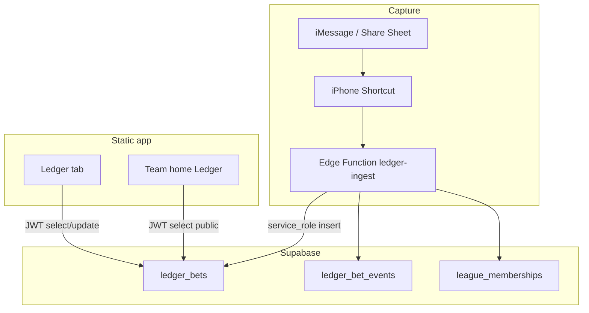

# Ledger buildout SDD (implementer’s runbook)

**Status:** App UI + SQL + Edge Function are on `main`. This document is the
**buildout / go-live SDD** — what to run in Supabase and on your phone so live
Ledger works end-to-end.

| Artifact | Role |
| --- | --- |
| [`LEDGER_SDD.md`](LEDGER_SDD.md) | Product rules (canonical) |
| [`LEDGER_BUILD_SDD.md`](LEDGER_BUILD_SDD.md) | v1 go-live runbook (wave12/13 + ingest) |
| [`LEDGER_JOIN_SDD.md`](LEDGER_JOIN_SDD.md) | v1.1 join / more exposure build design |
| [`LEDGER_NOTE_SDD.md`](LEDGER_NOTE_SDD.md) | v1.2 / v1.3 build + push-to-URL steps |
| [`plans/ledger_compose_and_alerts.md`](plans/ledger_compose_and_alerts.md) | Locked plan: note → Send; SMS on Send |
| [`plans/ledger_and_league_tab.md`](plans/ledger_and_league_tab.md) | Shipped plan: League tab + Ledger v1 |
| [`plans/ledger_privacy_views.md`](plans/ledger_privacy_views.md) | Shipped plan: my slips, privacy, team W/L |
| [`plans/ledger_join_exposure.md`](plans/ledger_join_exposure.md) | Planning archive for join SDD |
| **This file** | Architecture + ordered v1 implementation steps |

---

## 1. Goal

Ship a Tip-Slip–style bet Ledger for Chuckle Fantasy:

1. **League** leftmost tab (Latest trade) — already shipped.
2. **Ledger** tab — my slips only; Accept / Decline / Cancel / Settle; Public/Private.
3. **Team home** — that seat’s public W/L money + public slips.
4. **Capture path** — iPhone Shortcut (group text + two seats) → `ledger-ingest`
   → `ledger_bets` → Ledger **Complete** then Accept.

---

## 2. Architecture



| Layer | Responsibility |
| --- | --- |
| SQL wave12 | Tables, status machine, party UPDATE RLS, expire RPC |
| SQL wave13 | `visibility`, SELECT = member AND (party OR public) |
| `ledger-ingest` | Secret-gated capture POST; two seats + `raw_text`; `$0` ok |
| App (JWT) | Read/patch; Complete on proposed; team page reads public slips |

**Project URL:** `https://gtqyvnkkjiksmmtmzubw.supabase.co`  
**Function URL (after deploy):**  
`https://gtqyvnkkjiksmmtmzubw.supabase.co/functions/v1/ledger-ingest`

---

## 3. Repo map (already on `main`)

| Path | What |
| --- | --- |
| [`db/wave12-ledger.sql`](../db/wave12-ledger.sql) | Schema + RLS + `ledger_expire_proposed` |
| [`db/wave13-ledger-visibility.sql`](../db/wave13-ledger-visibility.sql) | Privacy column + SELECT tighten |
| [`supabase/functions/ledger-ingest/index.ts`](../supabase/functions/ledger-ingest/index.ts) | Shortcut ingest |
| [`generate-page.mjs`](../generate-page.mjs) | `renderLedger`, team Ledger, visibility toggle |
| Design Mode | Seed slips so UI is demoable without SQL |

Go-live is Supabase + slim Shortcut + this app build (Complete on Ledger).

---

## 4. Data model (summary)

### `ledger_bets`

Key columns: `sleeper_league_id`, `title`, `terms`, `odds`, `amount_cents`,
`side_a` / `side_b` (Sleeper user ids), `proposer`, `status`, `side_a_lock` /
`side_b_lock`, `deadline_at`, `winner`, `visibility` (`public`\|`private`),
`source`, `raw_hash`.

### Status machine

```
proposed → open          (both locks true)
proposed → declined | canceled | expired
open → settled | canceled (admin later)
```

### Visibility

| Value | Who can SELECT |
| --- | --- |
| `public` (default) | Any league member |
| `private` | Only `side_a` / `side_b` |

Own Ledger tab **client-filters** to slips where you are a party (even if RLS also
returns other members’ public slips).

---

## 5. Acceptance criteria (go-live done when)

- [ ] wave12 + wave13 + wave16 + wave17 ran without error in SQL Editor
- [ ] `ledger_bets` / `ledger_bet_events` exist; `visibility` column present
- [ ] `ledger-ingest` deployed; `LEDGER_INGEST_SECRET` set
- [ ] curl smoke test returns `{ "ok": true, "bet_id": "…" }` (two seat **ids** + `raw_text`)
- [ ] Signed-in member sees that slip on **Ledger** with quoted group text
- [ ] Party can **Complete** title / amount / odds, then counterparty Accept → `open`
- [ ] Either party can toggle Private; other members do **not** see it on team home
- [ ] Team home for a seat shows public Taken from / Lost to / Bets lost when settled public slips exist
- [ ] Design Mode still shows seeded slips without Supabase

---

## 6. Implementation steps (operator)

Do these in order. Times are wall-clock, not estimates of engineering work.

### Step 0 — Confirm you are on latest `main`

```bash
git checkout main
git pull origin main
```

Live site: https://slabslip.github.io/cuckle-trade-tracker/  
Hard-refresh after Pages deploys (or wait ~1–2 minutes after merge).

### Step 1 — Run wave12 SQL

1. Open [Supabase SQL Editor](https://supabase.com/dashboard/project/gtqyvnkkjiksmmtmzubw/sql).
2. Open repo file `db/wave12-ledger.sql` → copy all → paste → **Run**.
3. Confirm success (no red error). Tables `ledger_bets` and `ledger_bet_events` appear under **Table Editor**.

### Step 2 — Run wave13 SQL

1. Same SQL Editor.
2. Paste all of `db/wave13-ledger-visibility.sql` → **Run**.
3. Confirm `ledger_bets` has a `visibility` column (default `public`).

### Step 2b — Run wave16 SQL (New wager handshake)

1. Same SQL Editor.
2. Paste all of `db/wave16-ledger-wager.sql` → **Run**.
3. Confirm `ledger_bets` has `house_odds` + `offer_rev`, and table `ledger_settle_votes` exists.

### Step 2c — Run wave17 SQL (NFL clocks + hints)

1. Same SQL Editor.
2. Paste all of `db/wave17-ledger-clock.sql` → **Run**.
3. Confirm `ledger_bets` has `clock_kind` + `clock_meta` + `suggest_note`, and table `ledger_seat_style` exists.

### Step 3 — Create ingest secret

1. Generate a long secret, e.g. macOS Terminal:

```bash
openssl rand -hex 32
```

2. Save it somewhere private (you will paste it into Supabase **and** the Shortcut).

### Step 4 — Set Edge Function secret

1. Supabase → **Project Settings** → **Edge Functions** → **Secrets**  
   (or CLI: `supabase secrets set LEDGER_INGEST_SECRET='…'`).
2. Add:
   - Name: `LEDGER_INGEST_SECRET`
   - Value: the string from Step 3  
   (`SUPABASE_URL` and `SUPABASE_SERVICE_ROLE_KEY` are already injected for hosted functions.)

### Step 5 — Deploy `ledger-ingest`

**Option A — CLI (from repo root)**

```bash
# Once: https://supabase.com/dashboard/account/tokens
export SUPABASE_ACCESS_TOKEN='sbp_…'
npx supabase login --token "$SUPABASE_ACCESS_TOKEN"
npx supabase link --project-ref gtqyvnkkjiksmmtmzubw
npx supabase functions deploy ledger-ingest --no-verify-jwt
```

`--no-verify-jwt` is correct for Shortcut calls that use the shared secret header
(not a user JWT). The function still checks `x-ledger-secret`.

**Option B — Dashboard**

1. Edge Functions → Create / Deploy.
2. Upload or sync `supabase/functions/ledger-ingest/index.ts`.
3. Disable “Verify JWT” if the Dashboard exposes that toggle (secret header is the gate).

### Step 6 — Smoke-test with curl

Replace `YOUR_SECRET` and `YOUR_ANON_KEY` (Settings → API → `anon` `public`).
Use **seat ids**, not nicknames:

```bash
curl -sS -X POST \
  'https://gtqyvnkkjiksmmtmzubw.supabase.co/functions/v1/ledger-ingest' \
  -H 'Content-Type: application/json' \
  -H 'apikey: YOUR_ANON_KEY' \
  -H 'Authorization: Bearer YOUR_ANON_KEY' \
  -H 'x-ledger-secret: YOUR_SECRET' \
  -d '{
    "sleeper_league_id": "1315431339301806080",
    "submitted_by": "458342725222133760",
    "raw_text": "TrumanCooper vs TipsUp — Stribling SF WR1 — $100 even",
    "side_a_name": "458342725222133760",
    "side_b_name": "457784547094818816"
  }'
```

Expect:

```json
{ "ok": true, "bet_id": "…", "status": "proposed", "deduped": false }
```

| Result | Meaning |
| --- | --- |
| `401 unauthorized` | Secret mismatch / header name wrong (`x-ledger-secret`) |
| `422` / `needs_review` | Sides missing or the same — send two different seat ids |
| `500 LEDGER_INGEST_SECRET missing` | Secret not set on the function |

### Step 7 — Build the iPhone Shortcut (two taps)

Delete any amount / odds / title / deadline / visibility menus. Keep only:

1. Share Sheet or Clipboard → variable `RawText`
2. Dictionary of the 10 seats → ids
3. Choose Your side → `SideA`; Their side → `SideB`
4. **Get Contents of URL** POST to
   `https://gtqyvnkkjiksmmtmzubw.supabase.co/functions/v1/ledger-ingest`
   - Headers: `Content-Type` = `application/json`, `apikey` + `Authorization: Bearer <anon>`,
     `x-ledger-secret` = secret
   - JSON: `sleeper_league_id`, `submitted_by`=`SideA`, `raw_text`=`RawText`,
     `side_a_name`=`SideA`, `side_b_name`=`SideB`

Fast path: Copy the message → Home Screen icon → two team taps. Favorite the
Shortcut in the share sheet so it is not under View More.

### Step 8 — Verify in the app

1. Sign in as a claimed seat (not Design Mode alone for live data).
2. Open **Ledger** → Refresh → quoted group text on the card.
3. **Complete** title / amount / odds → Save.
4. Other party **Accept** → status `open`.
5. Toggle **Private** → confirm another member’s **team home** does not list that slip.
6. Settle a public slip → on the winner/loser’s **team home**, check Taken from / Lost to / Bets lost.

### Step 9 — Design Mode sanity (no SQL required)

1. Open Design Mode / design league home.
2. Ledger tab still shows seeded slips (including private demo + settled W/L).
3. Open a team → public Ledger section still renders.

---

## 7. Troubleshooting

| Symptom | Fix |
| --- | --- |
| Ledger empty while signed in | wave12/13 not run; or JWT seat not in `league_memberships` for that league |
| Accept fails silently / toast error | Not a party; or RLS UPDATE denied — confirm your Sleeper seat matches `side_a`/`side_b` |
| Team home missing W/L | No **settled** + **public** slips for that seat yet |
| Shortcut 401 | Secret or header typo; redeploy after setting secret |
| `sides must be two different seats` | Same seat twice, or a name (not an id) collapsed via empty team_name — use ids |
| Stale UI | Hard-refresh after this ship (`chuckle-shell-v199-ledger-syntax`) |

### After merge — redeploy ingest + slim the phone

From repo root on the shipped commit:

```bash
npx supabase functions deploy ledger-ingest --no-verify-jwt
```

Then on the iPhone: remove money / odds / title menus. Capture is `raw_text` + two seats only.

---

## 8. Out of scope (do not build in this go-live)

- Long Shortcut money / odds menus (dashboard start is **New wager**)
- Tip Slip green/cream skin
- Commissioner force-edit after open
- Discord ingest
- SMS vendor / collecting phone numbers (until **v1.3**)
- Shortcut note capture (later; not the Ledger start button)

Product detail and edge-case tables: [`LEDGER_SDD.md`](LEDGER_SDD.md).

---

## 9. Next: join / more exposure (v1.1)

**Not part of Steps 1–8.** Spec ready to build; schema/UI not on `main` yet.

- **Implementation SDD:** [`LEDGER_JOIN_SDD.md`](LEDGER_JOIN_SDD.md)  
- Product rules: [`LEDGER_SDD.md`](LEDGER_SDD.md) § Join / more exposure  
- Planning archive: [`plans/ledger_join_exposure.md`](plans/ledger_join_exposure.md)  
- Future build: `db/wave14-ledger-join.sql` + Open board / Join sheet / Accept exposure UI

When implementing v1.1, follow [`LEDGER_JOIN_SDD.md`](LEDGER_JOIN_SDD.md) §7, add wave14
to the SQL checklist above, and extend acceptance criteria for join → Accept → leg settle.

---

## 10. Next: note → Finish → Send (v1.2 / v1.3)

**Not part of Steps 1–8.** Follow the implementation SDD when you build it.

- **Implementation:** [`LEDGER_NOTE_SDD.md`](LEDGER_NOTE_SDD.md) (§11 order, §12 push to Pages)  
- **Product:** [`LEDGER_SDD.md`](LEDGER_SDD.md) § Note → Finish → Send  
- **Archive:** [`plans/ledger_compose_and_alerts.md`](plans/ledger_compose_and_alerts.md)

Any claimed seat files. Share the Shortcut once. Do not SMS or badge a draft note.
