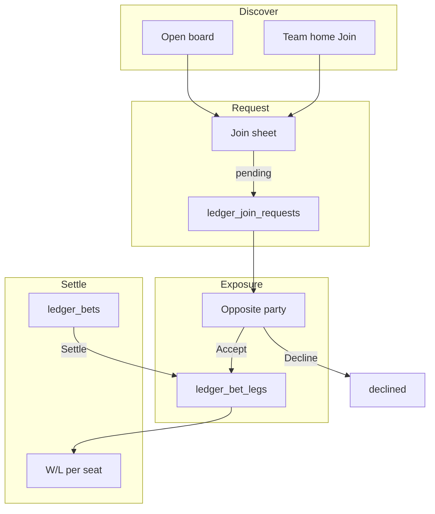

# Ledger Join SDD (v1.1 — more exposure)

**Status:** Spec ready to build. App v1 Ledger is on `main`; this SDD is the
**implementation design** for join / more exposure.

| Artifact | Role |
| --- | --- |
| [`LEDGER_SDD.md`](LEDGER_SDD.md) | Product rules (canonical, all versions) |
| [`LEDGER_BUILD_SDD.md`](LEDGER_BUILD_SDD.md) | v1 go-live runbook (wave12/13 + ingest) |
| [`plans/ledger_join_exposure.md`](plans/ledger_join_exposure.md) | Planning archive that fed this SDD |
| **This file** | v1.1 build design: schema, RLS, UI, acceptance, ordered steps |

---

## 1. Goal

Let any league member **join a locked public bet** by picking a side and stake.
The **opposite side** Accepts (takes more exposure) or Declines. Accepted joins
settle as **legs** of the parent slip.

### In scope

1. SQL `wave14` — `ledger_join_requests`, `ledger_bet_legs`, RLS, event kinds.
2. Ledger **Open board** + **Join** sheet.
3. Pending join chips + Accept/Decline on My slips (opposite side).
4. Settlement + team-home W/L include accepted legs.
5. Design Mode seeds for join demo; cache bump.

### Out of scope

- Parimutuel auto-match (no Accept)
- Splitting one join across multiple acceptors
- Joining **private** bets
- Compose-bet form, Tip Slip skin, Discord ingest

---

## 2. Architecture



| Layer | Responsibility |
| --- | --- |
| Parent `ledger_bets` | Original two-party slip; settle source of truth |
| `ledger_join_requests` | Pending / accepted / declined join asks |
| `ledger_bet_legs` | Locked exposure per seat per side |
| App JWT | Insert request; opposite side updates; read public open board |

---

## 3. Product rules (locked)

| Rule | Detail |
| --- | --- |
| Joinable | `status = open` **and** `visibility = public` |
| Not joinable | Private; `proposed` / terminal; already a party on parent |
| Joiner picks | `side_a` or `side_b` + `amount_cents` (UI defaults to parent amount) |
| Who Accepts | Existing locked party on **opposite** side; first Accept wins |
| Settlement | Same winner/push as parent; W/L = sum of legs per seat |
| Discovery | Open board + team-home **Join** |

Parent `amount_cents` stays the original stake for display. **Exposure totals** =
sum of accepted legs per side.

---

## 4. Data model (`db/wave14-ledger-join.sql`)

### 4.1 `ledger_join_requests`

```sql
-- Conceptual; exact SQL ships in wave14
create table public.ledger_join_requests (
  id uuid primary key default gen_random_uuid(),
  bet_id uuid not null references public.ledger_bets(id) on delete cascade,
  joiner text not null,
  side text not null check (side in ('side_a', 'side_b')),
  amount_cents integer not null check (amount_cents >= 0),
  status text not null default 'pending'
    check (status in ('pending', 'accepted', 'declined', 'canceled')),
  created_at timestamptz not null default now(),
  updated_at timestamptz not null default now()
);
```

Insert guard (trigger or RPC): parent must be `open` + `public`; joiner ≠ `side_a`
and ≠ `side_b`; optional unique pending per `(bet_id, joiner)`.

### 4.2 `ledger_bet_legs`

```sql
create table public.ledger_bet_legs (
  id uuid primary key default gen_random_uuid(),
  bet_id uuid not null references public.ledger_bets(id) on delete cascade,
  seat text not null,
  side text not null check (side in ('side_a', 'side_b')),
  amount_cents integer not null check (amount_cents >= 0),
  source_request_id uuid references public.ledger_join_requests(id),
  created_at timestamptz not null default now()
);
```

**Seed on first Accept:** if parent has no legs yet, insert two legs for original
`side_a` / `side_b` at parent `amount_cents`, then insert the joiner’s leg.

### 4.3 Events

Extend `ledger_bet_events.kind` (or payload) with:

`join_requested` · `joined` · `join_declined` · `join_canceled`

### 4.4 RLS

| Action | Who |
| --- | --- |
| SELECT requests/legs | League member if parent public; else party or joiner |
| INSERT request | Authenticated member; not already a party; parent `open`+`public` |
| UPDATE Accept/Decline | Caller’s seat is opposite side on parent; status was `pending` |
| Cancel own pending | Joiner only |

Prefer a single RPC `ledger_accept_join(request_id)` that:

1. Locks the pending row.
2. Seeds original legs if missing.
3. Inserts joiner leg.
4. Sets request `accepted`.
5. Writes `joined` event.

Decline can be a simple UPDATE + event.

---

## 5. App surfaces ([`generate-page.mjs`](../generate-page.mjs))

### 5.1 Ledger tab

| Section | Content |
| --- | --- |
| **My slips** | Existing cards; if opposite side and pending joins → Accept / Decline chips |
| **Open board** | Public `open` bets where viewer ∉ {side_a, side_b}; **Join** button |

### 5.2 Join sheet

- Side radios (show claim labels from parent when present)
- Amount field (default parent dollars)
- Confirm → POST/insert join request → toast “Waiting on opposite side”
- Errors: not joinable, already pending, signed out

### 5.3 Team home

On public `open` cards for another seat: **Join** if viewer is not a party (same sheet).

### 5.4 Settlement & W/L

- Settle still patches parent `winner` / `settled`.
- Team-home Taken from / Lost to / Bets lost: aggregate **accepted legs** for that seat
  (fallback to parent amount if no legs row exists yet — pre-wave14 rows).

### 5.5 Design Mode

Seed:

1. Public `open` two-party bet (viewer not a party) → appears on Open board.
2. Optional pending join where viewer is opposite side → Accept/Decline demo.
3. Settled parent with multiple legs → W/L demo.

Bump `DATA_V` + SW cache on UI ship.

---

## 6. Acceptance criteria

- [ ] wave14 applied; tables + RLS present
- [ ] Open board lists only public `open` slips the viewer is not on
- [ ] Join creates `pending` request; opposite side sees Accept/Decline
- [ ] Accept creates legs (including seeded originals) and clears pending
- [ ] Decline leaves parent exposure unchanged
- [ ] Private / proposed / already-party slips reject Join
- [ ] Settle applies to all accepted legs; team-home W/L matches leg sums
- [ ] Design Mode demos Open board + Accept without Supabase

---

## 7. Implementation order

1. **SQL** — author + land [`db/wave14-ledger-join.sql`](../db/wave14-ledger-join.sql); document in SUPABASE_SETUP §10.
2. **Client fetch** — load requests/legs with bets; Design Mode seeds.
3. **Open board + Join sheet** — discover + create pending.
4. **Accept / Decline** — RPC or guarded PATCH; refresh cards.
5. **Settle + team W/L** — include legs.
6. **Docs** — mark plan archive Shipped; add wave14 to [`LEDGER_BUILD_SDD.md`](LEDGER_BUILD_SDD.md) checklist; link this SDD from [`LEDGER_SDD.md`](LEDGER_SDD.md).

### Operator steps (after code merges)

1. Supabase SQL Editor → Run `db/wave14-ledger-join.sql`.
2. Hard-refresh app (new cache key).
3. As member A/B: lock a **public** bet.
4. As member C: Open board → Join side A for $X.
5. As opposite party: Accept → confirm exposure totals.
6. Settle → confirm C’s W/L on team home.

---

## 8. File map (to create/touch when building)

| Path | Change |
| --- | --- |
| `db/wave14-ledger-join.sql` | New |
| `generate-page.mjs` | Open board, Join sheet, Accept/Decline, leg W/L, seeds, `DATA_V` |
| `sw.js` | Cache bump |
| `docs/SUPABASE_SETUP.md` | §10 wave14 bullet |
| `docs/LEDGER_BUILD_SDD.md` | Promote §9 into checklist |
| `docs/plans/ledger_join_exposure.md` | Status → Shipped when done |

---

## 9. Relationship to v1 go-live

v1 go-live (wave12/13 + ingest) does **not** require wave14. Ship join only after
v1 Ledger is live and this SDD’s acceptance list is green.

Product one-liner remains in [`LEDGER_SDD.md`](LEDGER_SDD.md) § Join / more exposure.
