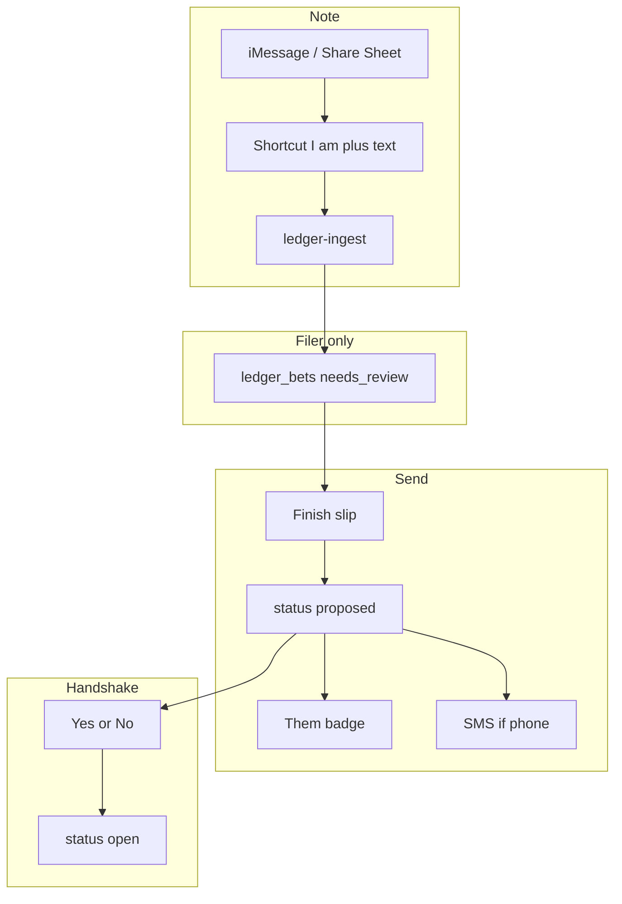

# Ledger Shortcut note — later capture (not the dashboard start)

**Audience:** the next coding agent who wires Shortcut / SMS after the dashboard
wager handshake is live.  
**Status:** Dashboard start path is **New wager** (Them, stake, −500…+500 meter,
description, clock, Send / Counter / Accept). A note is **Shortcut-only, later**.
Do not put Add note / Save note / four dollar boxes back on Ledger.  
**Product rules:** [`LEDGER_SDD.md`](LEDGER_SDD.md) (rules 1, 10–14).  
**SQL:** [`db/wave16-ledger-wager.sql`](../db/wave16-ledger-wager.sql) for the
dashboard handshake; wave15 only if leftover drafts must stay insertable.  
**v1 go-live:** [`LEDGER_BUILD_SDD.md`](LEDGER_BUILD_SDD.md)

Do **not** mix in join / exposure ([`LEDGER_JOIN_SDD.md`](LEDGER_JOIN_SDD.md)).

Live URL (GitHub Pages from `main`): https://slabslip.github.io/cuckle-trade-tracker/

---

## 1. Goal

**On Ledger today:** place a wager with a teammate (house / meter / clock).
Language is wager / send / counter / accept / lock.

**Later (this doc):** a Shortcut that only **saves the group text** so someone
can finish money on the site if they want. It is not the start button.

Anyone in the league can later:

1. Drop a group-chat line into a Shortcut (or a Share Extension).
2. Open Chuckle → Ledger and attach that text to a **New wager**, or finish a
   leftover $0 card.
3. Them **Accept** / **Counter** / **No**.
4. Optionally get an SMS **only when someone Sends to them**.

Truman is not the clerk.

### In scope (later Shortcut)

1. `ledger-ingest` note mode (`raw_text` + `submitted_by` only).
2. Leftover **Complete** on $0 / old cards (not a new compose UI).
3. Optional v1.3 SMS on Send.
4. Slim Shortcut + Pages push steps.

### Out of scope

- Dashboard **Add note** / **Save note** / four empty dollar boxes as the start path.
- Join / `ledger_join_requests` / wave14.
- Native iOS Share Extension (v1.4).
- Auto-reading iMessage.
- SMS on note create.
- In-app payout.

---

## 2. Architecture



| Layer | Responsibility |
|---|---|
| `db/wave15-ledger-notes.sql` | Null `side_b`; skip proposer auto-lock on `needs_review`; hide drafts from everyone but the filer; `terms_json`; `app_profiles.phone_e164` |
| `ledger-ingest` | Note body → draft row. Keep old two-side body working. **Never SMS.** |
| App JWT (`generate-page.mjs`) | Finish (PATCH draft), Send (PATCH → `proposed` + lock you), Yes/No (existing lock / decline), badge |
| `ledger-notify` (v1.3) | After Send, text Them if they have a phone. Fail soft. |

There is **no** `ledger-action` function today. Keep using `PATCH` on `ledger_bets` (same as Complete / Accept). Add `ledger-notify` only for SMS.

---

## 3. What is already live (do not redo)

After the capture-first PR is on `main` and Pages is refreshed:

| Piece | Behavior |
|---|---|
| Table | `ledger_bets` (not `ledger_slips`) |
| `ledger-ingest` | `sleeper_league_id` + `raw_text` + two seat IDs (`side_a_name` / `side_b_name`). Stores `source_text`. Amount can be $0. Hash = league + sides + raw_text. Status `proposed`. Proposer auto-locks. |
| Ledger tab | Quotes `source_text`. **Needs details** + **Complete** (title / amount / one odds / deadline). |
| Accept | Toast if $0: put a dollar amount first. |
| Shortcut | Still two seat IDs (required until wave15). |
| Writes | Client `PATCH /ledger_bets?id=eq.…` with the member JWT. |

**Do not** keep building on Complete + one odds field. Replace that UI with Finish slip (section 6).

---

## 4. Locked product rules (implement these)

| Rule | Detail |
|---|---|
| Note ≠ bet | Shortcut saves text. No Them required. No lock. No badge. No SMS. |
| Draft status | `needs_review`. `side_a` = filer. `side_b` = null. `proposer` = filer. Both locks **false**. `visibility` = `private`. `amount_cents` = 0. |
| Filer only | Only the proposer SELECTs a `needs_review` row. Drafts never on team home. |
| Finish slip copy | You / Them / What’s the bet / You put in / You win / They put in / They win. Never: odds, side A, juice, Accept, Decline. |
| Send | Blocked unless Them set and all four amounts > 0. Then: `status = proposed`, lock **you**, Them unlocked, `visibility` default `public` (they can toggle later). |
| Badge | Count of `proposed` slips sent **to you** (you are the unlocked party, amount > 0). Opening the tab does not clear it. No `localStorage` seen. |
| Yes / No | Yes = today’s Accept (`side_*_lock = true` → trigger sets `open`). No = today’s Decline (`declined`). |
| SMS | Only on Send, only to Them, only if `phone_e164` set. Once per bet. |
| Every seat files | Same Shortcut. I-am is their seat. Truman is not default. |
| Join | Untouched. |

Status after each step:

```
needs_review  →  proposed  →  open
     (note)        (Send)      (Yes)
                 ↘ declined (No)
                 ↘ canceled (you Cancel)
```

---

## 5. Wave 15 SQL (must ship before note-only ingest)

File: [`db/wave15-ledger-notes.sql`](../db/wave15-ledger-notes.sql) — **create this file in the implementation PR.**

Today `ledger_bets.side_b` is `NOT NULL` and `ledger_bets_distinct_sides` is `side_a <> side_b`. The insert trigger **auto-locks the proposer**. Wave13 SELECT shows every **public** row to the league — a public draft would leak.

```sql
-- 1. One-sided drafts
ALTER TABLE public.ledger_bets
  ALTER COLUMN side_b DROP NOT NULL;

ALTER TABLE public.ledger_bets
  DROP CONSTRAINT IF EXISTS ledger_bets_distinct_sides;

ALTER TABLE public.ledger_bets
  ADD CONSTRAINT ledger_bets_sides_ok CHECK (
    side_b IS NULL OR side_a <> side_b
  );

-- 2. Four dollar boxes (Finish slip). amount_cents stays the "you put in" figure.
ALTER TABLE public.ledger_bets
  ADD COLUMN IF NOT EXISTS terms_json jsonb NOT NULL DEFAULT '{}'::jsonb;

-- 3. Event kind for Send (SMS idempotency)
ALTER TABLE public.ledger_bet_events
  DROP CONSTRAINT IF EXISTS ledger_bet_events_kind_check;
ALTER TABLE public.ledger_bet_events
  ADD CONSTRAINT ledger_bet_events_kind_check
  CHECK (kind in (
    'created','accepted','declined','edited','settled','note','canceled','expired','sent'
  ));

-- 4. Optional SMS opt-in (v1.3 — same file is fine)
ALTER TABLE public.app_profiles
  ADD COLUMN IF NOT EXISTS phone_e164 text;

COMMENT ON COLUMN public.app_profiles.phone_e164 IS
  'Optional E.164. SMS only when someone Sends a slip to this seat.';
```

**Rewrite `ledger_bets_guard_write`** so that when `NEW.status = 'needs_review'`:

- Do **not** auto-lock the proposer.
- Allow `side_b` null.
- Do **not** promote to `open`.

Keep the existing both-locks → `open` rule for `proposed`.

**Replace SELECT RLS** (wave13 policy `ledger_bets_select_member`) so a draft is filer-only even if someone flips visibility:

```
member
AND (
  (status = 'needs_review' AND sleeper_user_id = proposer)
  OR (
    status <> 'needs_review'
    AND (visibility = 'public' OR sleeper_user_id IN (side_a, side_b))
  )
)
```

Mirror the same gate on `ledger_bet_events` SELECT.

**UPDATE policy:** party is `side_a` or `side_b`. With `side_b` null, only the filer (`side_a`) can PATCH the draft. That is correct.

Operator: paste in Supabase SQL Editor, Run, confirm green.

**Do not deploy note-only ingest until this ran.** Current insert will 500/400 if `side_b` is omitted.

---

## 6. Ingest — note mode

File: [`supabase/functions/ledger-ingest/index.ts`](../supabase/functions/ledger-ingest/index.ts)

### 6.1 Request (new)

Keep field names the live Shortcut already uses (`sleeper_league_id`, `submitted_by`, `raw_text`):

```json
{
  "sleeper_league_id": "1315431339301806080",
  "submitted_by": "458342725222133760",
  "raw_text": "truman you owe me a beer if berg goes off"
}
```

Keep the old two-side body working so today’s Shortcut does not break the same day.

### 6.2 Rules

| If | Do |
|---|---|
| `raw_text` missing / blank | 400 |
| `submitted_by` not a claimed seat | 400 / 422 `unknown filer` |
| Note mode (no `side_a_name` / `side_b_name`) | Insert draft: `side_a` = filer, `side_b` = null, `proposer` = filer, `status` = `needs_review`, both locks false, `visibility` = `private`, `amount_cents` = 0, `source_text` = raw_text, `title` = first line, `source` = `shortcut` |
| Old mode (two sides) | Same as today (`proposed`, proposer locked) |
| Hash | Note: `sha256(league + filer + raw_text)`. Old: `sha256(league + side_a + side_b + raw_text)` |
| Duplicate hash | 200 `{ ok, bet_id, deduped: true }` — no second row |
| SMS | **Never** in this function |

### 6.3 Deploy

```bash
npx supabase functions deploy ledger-ingest --no-verify-jwt
```

Smoke (after wave15):

```bash
curl -sS -X POST \
  'https://gtqyvnkkjiksmmtmzubw.supabase.co/functions/v1/ledger-ingest' \
  -H "apikey: $ANON" \
  -H "Authorization: Bearer $ANON" \
  -H "x-ledger-secret: $SECRET" \
  -H "Content-Type: application/json" \
  -d '{"sleeper_league_id":"1315431339301806080","submitted_by":"458342725222133760","raw_text":"smoke note"}'
```

Expect 200 and a `needs_review` row only you can see.

---

## 7. Dashboard — Finish slip (replace Complete)

Files: `generate-page.mjs` (search `ledgerComplete`, `ledger-complete`, `Needs details`).

### 7.1 Card for a draft you created (`needs_review`, you are proposer)

Show, in this order:

1. Quote of `source_text` (already there).
2. **You** — your claimed seat name (read-only).
3. **Them** — `<select>` of the other claimed seats. Required.
4. **What’s the bet** — one sentence. Prefill from first line of the note; they can edit.
5. Four boxes, labels exactly:
   - You put in
   - You win
   - They put in
   - They win
6. Optional: settle by (date). Hide under “More” if it clutters.
7. Primary button: **Send to [Them’s name]** — disabled until Them + “what’s the bet” + all four boxes > 0.

Do **not** show: odds, side A / side B, Accept, Decline, Open, Join.

### 7.2 Persist

**Save draft** (optional, or auto-save on blur):

```js
PATCH ledger_bets
  side_b, title,
  terms_json: {
    you_put_cents, you_win_cents, they_put_cents, they_win_cents
  },
  amount_cents: you_put_cents   // keep $0 guards honest
// status stays needs_review
```

Still filer-only. **No SMS. No badge for Them.**

**Send** (the only action that notifies):

1. Require four amounts > 0 and `side_b` set and ≠ you.
2. PATCH:

```js
{
  side_b,
  title,
  terms: "You put in $X. If you win you get $Y. They put in $A. If they win they get $B.",
  terms_json: { … },
  amount_cents: you_put_cents,
  status: "proposed",
  side_a_lock: true,   // you are side_a
  side_b_lock: false,
  visibility: "public" // default; they can Private later
}
```

3. Insert `ledger_bet_events` kind `sent`.
4. Them can now SELECT the row (wave15 RLS).
5. Badge ticks (section 8).
6. If Them has `phone_e164`, call `ledger-notify` (section 9). **Not before this step.**

If the trigger would auto-lock Them, do not set their lock true.

### 7.3 Card for Them (after Send, `proposed`, they are unlocked)

Show:

- Who sent it (filer name).
- What’s the bet.
- The four amounts with the same labels (sender wording is fine; prefix “They say:” if needed).
- Quote of the original note if present.
- Buttons: **Yes, I’m in** / **No**

Wire:

| Button | Same as today’s |
|---|---|
| Yes, I’m in | `ledgerAccept` → their `side_*_lock = true` → trigger sets `open` |
| No | `ledgerDecline` → `declined` |

Do not rename DB statuses. Relabel the buttons only.

If they tap Yes and `amount_cents` is 0, toast: **Ask them to finish the dollar amounts** — do not accept (already true).

### 7.4 Your card after Send, before they answer

- Chip: **Waiting on [name]** (already exists as “Waiting on them”).
- No Yes / No on your side.
- v1.2: no edit after Send (avoids a moving-target SMS). Cancel + redo if Them is wrong.

### 7.5 Copy you must not use

Accept, Decline, Odds, Side A, Juice, vig, American — not on the Finish / Yes card.

### 7.6 Client filter

`ledgerFiltered()` already keeps “my slips.” Also:

- Hide `needs_review` unless `proposer === me`.
- Team home: exclude `needs_review` (and do not treat drafts as public).

Deep link: on boot, if `?tab=ledger`, set `homeTab = "ledger"`.

---

## 8. Badge

**Count = slips where you are the unlocked party, `status = 'proposed'`, `amount_cents` > 0.**

```js
(ledgerBets || []).filter((b) => {
  const me = authSeatId();
  if (!me || b.status !== "proposed" || !Number(b.amount_cents)) return false;
  if (b.status === "needs_review") return false;
  const unlocked =
    (String(b.side_a) === String(me) && !b.side_a_lock)
    || (String(b.side_b) === String(me) && !b.side_b_lock);
  return unlocked;
}).length
```

- Drafts do **not** count.
- Opening the Ledger tab does **not** clear it.
- Yes, No, or they Cancel decrements by one.
- Do not use `localStorage` “seen.”

Tab label: `Ledger` + numeric badge, same pattern as News / Alerts dots.

---

## 9. SMS (v1.3 — after Finish/Send works)

### 9.1 Settings

Settings → Profile: **Text me when someone sends a slip** + phone field. Save `app_profiles.phone_e164`. Empty = opt out.

### 9.2 When

Only after a successful Send (`status` is `proposed` and a `sent` event exists).

Never: note ingest, Save draft, Yes, No, expire, void.

### 9.3 Body

```
Chuckle: [You] sent you a slip. Open Ledger to say if you're in.
https://slabslip.github.io/cuckle-trade-tracker/?tab=ledger
```

No dollar amounts in SMS (details are in the app).

### 9.4 Provider

New Edge Function `ledger-notify` (JWT required — the sender is signed in). Secrets: `TWILIO_ACCOUNT_SID`, `TWILIO_AUTH_TOKEN`, `TWILIO_FROM`. Look up Them’s `app_profiles.phone_e164` via their membership `auth_user_id`. If no number or already a `sent` event with `payload.sms = true`, no-op. Fail soft — slip stays sent if SMS fails.

US numbers only unless you add country handling.

---

## 10. Shortcut (after wave15 + note ingest)

Replace the current two-ID Shortcut.

1. Input: **Ask for Text** (or Shortcut Input when run from Share Sheet).
2. Dictionary **I am** → seat IDs (same list as today).
3. Get Value for **I am**.
4. Get Contents of URL:
   - Method POST
   - URL: `https://gtqyvnkkjiksmmtmzubw.supabase.co/functions/v1/ledger-ingest`
   - Headers: `apikey`, `Authorization: Bearer` (same anon key), `x-ledger-secret`, `Content-Type: application/json`
   - Body JSON:
     - `sleeper_league_id` = `1315431339301806080`
     - `submitted_by` = I-am value
     - `raw_text` = the text
5. Show Notification: “Saved to your Ledger. Open Chuckle to finish and send.”
6. Airdrop / iCloud link to the other seats. Each person sets **I am** once.

Do **not** put Truman’s seat as a default for everyone.

Until wave15 is applied, keep the old two-ID Shortcut.

---

## 11. Implementation order (do not skip)

| Step | What | Done when |
|---|---|---|
| 0 | Merge capture-first PR to `main` so v1 is on the URL | Live Ledger quotes source text |
| 1 | Author + run `db/wave15-ledger-notes.sql` | `side_b` nullable; drafts hidden |
| 2 | Note ingest + keep old two-side body | Curl note returns 200 `needs_review` |
| 3 | Finish slip UI + save draft (still `needs_review`) | Filer sees form; Them does not |
| 4 | Send PATCH + badge + `?tab=ledger` | Them sees slip; badge ticks |
| 5 | Relabel Accept/Decline → Yes, I’m in / No | Copy only |
| 6 | Slim Shortcut + share link | Each seat can file a note |
| 7 | Phone field + `ledger-notify` | Optional; v1.3 |

Commit and push after **each** of 1–5 so Pages can pick up UI as you go (SQL/functions are **not** on Pages — deploy those separately).

---

## 12. How to get it on the live URL

Live site is **GitHub Pages from `main`**. There is no second host.

`node generate-page.mjs` writes `index.html`. Pushing `index.html` + `sw.js` to `main` **is** the deploy. Then hard-refresh.

### 12.1 First: get v1 capture-first on the URL

```bash
# review the capture-first PR, then on GitHub: Merge
# or locally:
git checkout main
git pull origin main
git merge cursor/ledger-capture-first-af37
git push origin main
```

Wait ~1–2 minutes. Hard-refresh https://slabslip.github.io/cuckle-trade-tracker/

You should see **Needs details** / quoted text on $0 slips.

Then from your Mac (functions are not deployed by Pages):

```bash
cd ~/cuckle-trade-tracker   # or your clone path
git pull origin main
npx supabase functions deploy ledger-ingest --no-verify-jwt
```

SQL waves 12–13 you already ran.

### 12.2 Build this SDD on a new branch

```bash
git checkout main
git pull origin main
git checkout -b cursor/ledger-note-send-af37

# ... implement wave15 + ingest + generate-page.mjs ...
node generate-page.mjs
# bump sw.js cache name (chuckle-shell-v…) and DATA_V

git add -A
git commit -m "ledger: note ingest and Finish slip"
git push -u origin cursor/ledger-note-send-af37
# open PR → merge to main
```

### 12.3 After each merge to `main`

1. **SQL** (once): Supabase → SQL Editor → paste `db/wave15-ledger-notes.sql` → Run.
2. **Functions:**

```bash
npx supabase functions deploy ledger-ingest --no-verify-jwt
# v1.3 only:
npx supabase functions deploy ledger-notify --no-verify-jwt
```

3. **Pages:** already updating from the merge. Wait ~1–2 minutes. Hard-refresh. If the old shell sticks, bump `sw.js` cache name again and push to `main`.
4. **Shortcut:** update on your phone; share the iCloud link.

### 12.4 Local preview before merge

```bash
node generate-page.mjs
python3 -m http.server 4173
# open http://127.0.0.1:4173
```

Design Mode still seeds slips — add one `needs_review` draft so Finish slip is walkable without SQL.

---

## 13. Tests the agent must run

1. **Note ingest** — curl as in §6.3. Row exists. Other seat’s Ledger does not include it.
2. **Finish without Send** — set Them + dollars, save. Them still cannot see it. No SMS. No badge on Them.
3. **Send** — Them’s list shows it. Badge = 1. SMS only if phone set.
4. **Yes, I’m in** — status `open`. Badge 0. Both see it.
5. **No** — status `declined`. Badge 0.
6. **$0 Send** — rejected.
7. **Accept on leftover v1 $0 card** — still toast (do not regress).
8. **Old two-side ingest** — still 200 after note mode ships.
9. **Team home** — draft never listed.
10. **Join** — unchanged; do not touch those files except to avoid conflicts.

---

## 14. Files you will touch

| File | Change |
|---|---|
| `db/wave15-ledger-notes.sql` | **New.** Null `side_b`, guard rewrite, RLS, `terms_json`, `phone_e164`, `sent` event. |
| `supabase/functions/ledger-ingest/index.ts` | Note body + note hash. Keep two-side body. |
| `supabase/functions/ledger-notify/index.ts` | **New (v1.3).** Twilio on Send. |
| `generate-page.mjs` | Finish slip UI, Send, Yes/No labels, badge, `?tab=ledger`, Design Mode draft seed, `DATA_V`. |
| `index.html` | Regenerated. |
| `sw.js` | Cache bump. |
| `docs/SUPABASE_SETUP.md` | Wave 15 in the table. |
| `docs/LEDGER_BUILD_SDD.md` | Point §10 at shipped work when done. |
| This file | Mark sections done as you ship. |

---

## 15. Definition of done

- Any claimed seat can file a note without picking Them.
- Only they see that note until they tap Send.
- Finish slip uses You / Them / four dollar boxes / “what’s the bet.”
- Send is the first moment Them sees it, the badge ticks, and SMS may fire.
- Them taps **Yes, I’m in** or **No**.
- Truman is not required for anyone else’s slip.
- Live URL shows the new UI after merge + hard-refresh.
- Join work is untouched.
