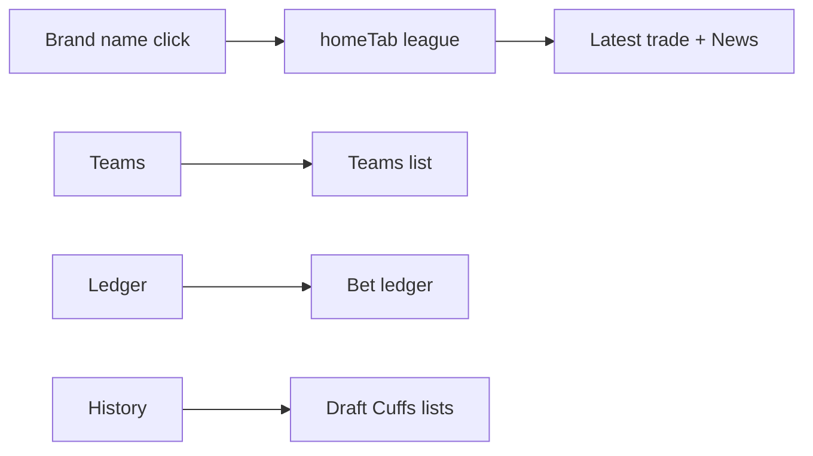
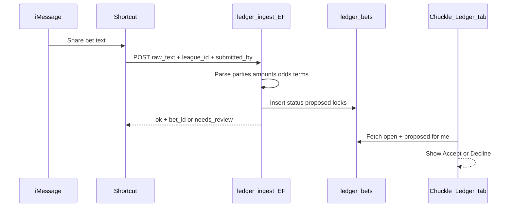
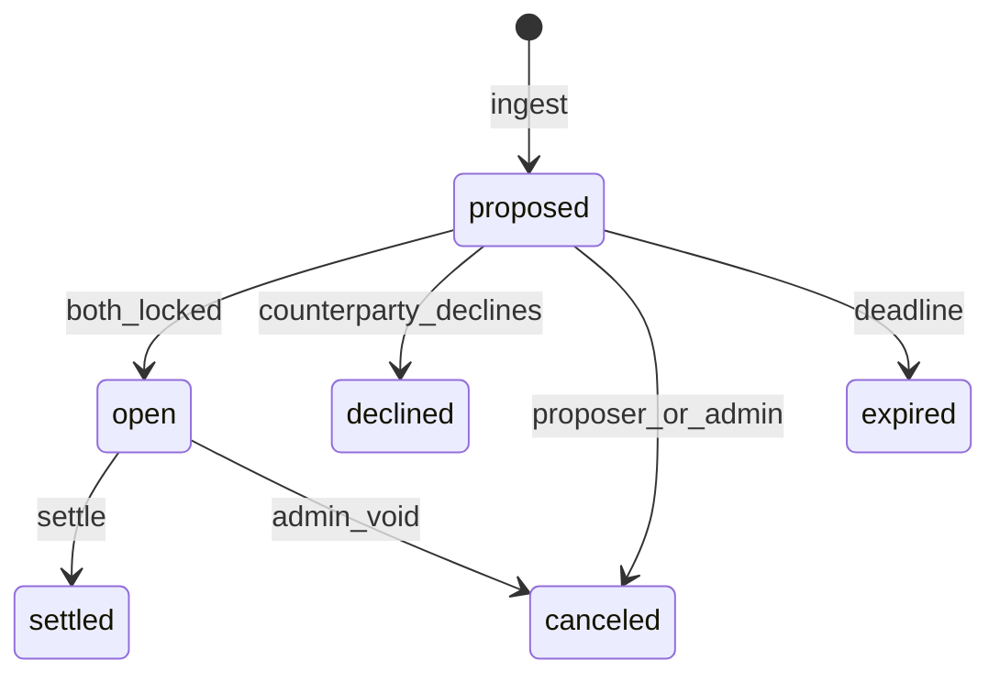

# League tab + bet Ledger

**Status:** Shipped — League leftmost tab, Ledger v1 (accept/lock, Shortcut ingest).

Canonical product rules: [`docs/LEDGER_SDD.md`](../LEDGER_SDD.md).

---

# League tab + bet Ledger workflow

## Decisions locked for this plan

- **Top tabs become:** `League | Teams | Ledger | History` (League far left). History keeps the current name (your “data” tab).
- **Brand Home icon (`#goHome`) is removed.** Centered league name still returns to League tab via existing `goLeagueHome()`.
- **Accept rule (default until you change it):** Shortcut ingest creates a **proposed** bet; **proposer is auto-locked**; the **other party must Accept or Decline**. Both locked → status `open`. Admin/commissioner can force-settle later.
- **Tip Slip screenshot = product reference**, not a port of an existing codebase (none in repo). Visual language stays Chuckle (dark + gold), not Tip Slip green/cream.

---

## Part 1 — Nav chrome (ship first, small)

Today: `homeTab = null` paints Latest trade; brand mounts `#goHome` ([`generate-page.mjs`](generate-page.mjs) `homeChips()`, `paintBrandHome()`, brand markup ~`goHome`).

Changes:

1. Add `homeTabAction("league", "League", …)` as **first** tab.
2. Default `homeTab = "league"` (not `null`). League body = current Latest trade (`leagueInProgress()`).
3. `setHomeTab("league")` always lands on Latest trade (no toggle-off to empty). Other tabs still toggle/swap in place.
4. Remove `#goHome` button + `paintBrandHome` home-icon wiring; keep Back chevron + league name + team flair.
5. Brand Back / `goLeagueHome` / `clearLeague` reset to `homeTab = "league"`.
6. Self-checks + `DATA_V` / SW cache bump.



---

## Part 2 — Ledger data model (Supabase live)

Static Pages JSON is wrong for accept/lock races. Mirror **votes**: live REST + RLS.

### Tables

**`ledger_bets`** (one bet / slip)

| Field | Purpose |
|---|---|
| `id` uuid | PK |
| `sleeper_league_id` | League scope |
| `title` | Short label |
| `terms` | Full bet text |
| `odds` text nullable | Freeform for v1 (`+150`, `even`, `2:1`) |
| `amount_cents` int | Stake (store cents; UI shows dollars) |
| `currency` | default `USD` |
| `side_a` / `side_b` | `sleeper_user_id` of parties |
| `side_a_claim` / `side_b_claim` | What each side is betting *on* (text) |
| `proposer` | `sleeper_user_id` who submitted |
| `status` | `proposed` → `open` → `settled` \| `declined` \| `canceled` \| `expired` |
| `side_a_lock` / `side_b_lock` | bool; proposer side true on insert |
| `deadline_at` timestamptz nullable | Season / settle-by |
| `winner` | nullable `side_a` \| `side_b` \| `push` when settled |
| `source` | `shortcut` \| `manual` \| `admin` |
| `source_text` | Raw group-text snippet |
| `created_at` / `updated_at` | |

**`ledger_bet_events`** (append-only audit)

- `bet_id`, `actor` (sleeper uid or `system`), `kind` (`created`,`accepted`,`declined`,`edited`,`settled`,`note`,`canceled`), `payload` jsonb, `created_at`

**`ledger_notes`** (optional v1.1)

- Tip Slip “notes” — can ship as events with `kind=note` first to avoid another table.

### RLS / identity

- Same pattern as `trade_votes`: JWT → `league_memberships.sleeper_user_id`.
- Read: any member of that `sleeper_league_id`.
- Write lock/accept: only if `auth seat ∈ {side_a, side_b}` and status allows.
- Insert via Shortcut: dedicated Edge Function with shared secret **or** authenticated user JWT (prefer JWT when Shortcut can sign in; else `ledger-ingest` function + league-scoped ingest token like news).

---

## Part 3 — End-to-end workflows

### A. Group text → Shortcut → ledger



**Shortcut payload (v1):**

```json
{
  "sleeper_league_id": "…",
  "submitted_by": "optional display or sleeper id",
  "raw_text": "TrumanCooper vs TipsUp — Stribling SF WR1 — $100 even — ends Dec 18",
  "title": "optional",
  "amount": 100,
  "odds": "even",
  "side_a_name": "TrumanCooper",
  "side_b_name": "TipsUp",
  "deadline": "2026-12-18"
}
```

Parser resolves names via `members.json` / aliases (same fuzzy path as news `target_name`). Ambiguous names → `needs_review` row or reject with actionable error (do not invent seats).

### B. Accept / lock

1. Insert: `status=proposed`, proposer’s `*_lock=true`, other `false`.
2. Counterparty opens Ledger (default filter: **My slips**) → card actions **Accept** / **Decline**.
3. Accept → set their lock true; if both locked → `status=open`, event `accepted`.
4. Decline → `status=declined`, event `declined` (terminal).
5. Proposer may **Cancel** while still `proposed`.
6. Idempotent: double-tap Accept is no-op if already locked.

### C. Settle (v1 admin / either party)

- From `open`: **Settle** picks winner / push → `status=settled`, set `winner`, event.
- Optional Tip Slip “Admin: ON”: only commissioner membership can edit/delete after open; parties can settle by mutual confirm later (v1.1). **v1:** either party or commissioner can settle (logged in events).

### D. Ledger UI (replace `renderLedger()` stub)

Chuckle styling; Tip Slip information architecture:

- Summary strip: total / open / settled / pending(proposed) / next deadline
- Filter: My slips | All | Head-to-head vs X
- Cards: title, parties, amount, odds, terms, status chip (`Needs your accept` / `Open` / …), deadline, actions by role
- Empty + error states (load fail, not signed in, no seat claimed)

---

## Part 4 — Edge cases, errors, loops

| Case | Behavior |
|---|---|
| Same person both sides | Reject at ingest |
| Unknown / ambiguous name | Reject or `needs_review`; never silent wrong seat |
| Duplicate Shortcut spam (same raw_text hash + parties + amount within N min) | Return existing `bet_id` (idempotent) |
| Accept after cancel/decline | 409 / no-op with toast |
| Accept when not a party | RLS deny + toast |
| Proposer Accept on own already-locked side | No-op |
| Both try Accept concurrently | Unique transition via `UPDATE … WHERE side_x_lock = false`; second is no-op |
| Signed out / no seat | Ledger read-only CTA: claim seat / sign in; no Accept |
| Shortcut without auth | Edge Function + ingest secret; still resolve `submitted_by` to a seat when possible |
| Edit after both locked | v1: deny (cancel + recreate) or commissioner-only edit with event |
| Deadline passed, still proposed | Cron or on-read mark `expired`; hide Accept |
| Multi-league | Always key by `sleeper_league_id`; Shortcut must send league id |
| Offline / REST fail | Toast + keep last good list; no fake success |
| News Shortcut confusion | Separate Shortcut + endpoint; do not overload `news_submissions` |
| Re-entry loops | Status is a strict state machine; UI actions derived only from status + locks + actor |

State machine:



---

## Part 5 — Implementation order

1. **Nav:** League tab + remove Home icon (Part 1) — ship alone if needed.
2. **Schema + RLS + Edge `ledger-ingest`** + docs in [`docs/SUPABASE_SETUP.md`](docs/SUPABASE_SETUP.md).
3. **Client:** `renderLedger()`, fetch/mutations, Accept/Decline/Cancel/Settle, summary + filters.
4. **Shortcut recipe** doc (copy of news Shortcut pattern in [`docs/NEWS_DISPATCH.md`](docs/NEWS_DISPATCH.md)).
5. **Hardening:** idempotency, expiry, commissioner admin, notes.

---

## Key code touchpoints

- [`generate-page.mjs`](generate-page.mjs): `homeChips`, `setHomeTab`, `renderLeagueHome`, `renderLedger`, brand `#goHome` / `paintBrandHome`, self-checks, `DATA_V`
- [`sw.js`](sw.js): cache bump
- New: Supabase migration SQL + `supabase/functions/ledger-ingest`
- Docs: setup + Shortcut payload

No reuse of `smack-tips` / news tips — wrong domain.
