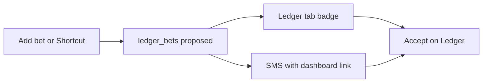

# Add bet on Ledger + Accept alerts

**Status:** Planned (v1.2 compose + bell; v1.3 SMS) — not built yet.  
Canonical product rules: [`docs/LEDGER_SDD.md`](../LEDGER_SDD.md).  
Go-live runbook (v1 capture): [`docs/LEDGER_BUILD_SDD.md`](../LEDGER_BUILD_SDD.md).

Shortcut capture (group text + two seats) stays the fast path. **Add bet** is the
other door. Alerts make sure the counterparty opens Ledger and Accepts.

---

## Goal

1. File a slip from the **Ledger** tab without the iPhone Shortcut (pick two teams
   on the dashboard).
2. Show an unread **bell / badge** on the Ledger top tab when you have a bet
   waiting on your Accept.
3. Later, SMS the counterparty a link that opens Ledger (optional phone on the
   seat). Phone does **not** choose Shortcut sides.

---

## v1.2 — Add bet + bell (no SMS)

### Add bet

| Rule | Detail |
| --- | --- |
| Where | Ledger tab only (not team home) |
| Who | Signed-in claimed seat |
| Fields | Two different league seats (chips from `members` / `league_memberships`), title, amount, odds, optional deadline / visibility / source note |
| Insert | JWT `POST` `ledger_bets` — existing `ledger_bets_insert_member` (proposer = you) in [`generate-page.mjs`](../../generate-page.mjs) |
| Locks | Proposer auto-locks; counterparty must Accept — same machine as Shortcut |
| Source | Optional paste of group text into `source_text` / `terms` |
| Shortcut `$0` | **Complete** still used; Add bet should send a real amount |

Cannot pick the same seat twice. Signed out / no seat → CTA, no insert.

### Ledger bell

Unread = `proposed` slips where you are a party **and** your `side_*_lock` is
false.

- Gold badge on the **Ledger** top-tab control (`homeTabAction("ledger", …)`).
- Opening Ledger (or Accept/Decline) clears that slip for you.
- v1 store: `localStorage`. Optional later: `ledger_bet_events` kind `seen`.
- List can sort “needs your accept” first.

### Deep link (needed for v1.3, cheap in v1.2)

Today `homeTab` is not in the query string. Add `?tab=ledger` (or equivalent) in
`setHomeTab` / `syncUrl` so an SMS or bookmark opens Ledger.

---

## v1.3 — Phone + SMS

| Rule | Detail |
| --- | --- |
| Phone | Optional on `league_memberships` (or Settings). Not required to file a bet |
| When | After insert or Complete, if the counterparty has a number |
| Body | Who proposed, title, link `https://slabslip.github.io/cuckle-trade-tracker/?tab=ledger` |
| Skip | No number saved → no SMS |
| Identity | Still Sleeper `user_id`. Phone is notify-only |
| Vendor | Operator secret (Twilio or similar) — not chosen in this plan |

Do **not** use phone numbers as Shortcut side pickers. Group iMessage cannot
infer the two parties from the thread.

---

## Out of scope here

- Building the form, badge, `?tab=ledger`, phone column, or SMS send
- Join / more exposure (v1.1)
- iMessage / email / PWA push
