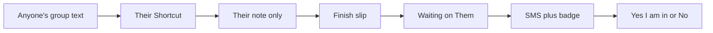

# Note → Finish → Send → Yes / No

**Status:** Final locked plan. Do not reopen these decisions.  
**Build this:** [`docs/LEDGER_NOTE_SDD.md`](../LEDGER_NOTE_SDD.md)  
**Product one-liners:** [`docs/LEDGER_SDD.md`](../LEDGER_SDD.md) rules 10–12  
**v1 already live:** [`docs/LEDGER_BUILD_SDD.md`](../LEDGER_BUILD_SDD.md)

The group-text Shortcut is only a **note**. It starts a slip. It is not the bet.
**Any claimed seat** files their own note from their own texts. You are not the
clerk. The dashboard writes the bet in plain language. SMS and the Ledger badge
fire only on **Send to [name]**.

---

## Locked decisions

| Decision | Lock |
|---|---|
| Table | `ledger_bets` (there is no `ledger_slips`) |
| Note row | `status = needs_review`, `side_b` null, both locks false, `visibility = private` |
| Send | `status = proposed`, you locked, Them unlocked |
| Yes | Today’s Accept → both locks → `open` |
| No | Today’s Decline → `declined` |
| Badge | Slips **sent to you** (`proposed`, you unlocked, amount > 0). Opening the tab does not clear it |
| SMS | Only on Send, only to Them, only if they opted in. Never on note create |
| Copy | You / Them / put in / win. Never odds, side A, Accept, Decline on the Finish card |
| Who files | Every claimed seat. Same Shortcut. You are not the clerk |
| Join | Separate SDD. Do not mix |

Until wave15 ships, live ingest still needs two seat IDs. Hide that slip from Them in the app until Send if you must ship UI first.

---

## Why the first v1.2/v1.3 draft was wrong

| Old rule | Bug | Now |
|---|---|---|
| Shortcut picks two seats and locks the proposer | Other person can Accept a `$0` slip | Draft. No locks. Filer-only until Send |
| SMS on insert or Complete | Texts “accept” before there is a bet | SMS **only** on Send |
| Bell = any proposed where lock is false | Drafts badge everyone | Badge = **sent to you** |
| `localStorage` seen | Wrong on the other phone | Live count |
| Odds / side A on the card | First-time bettors bounce | You vs Them. You put in $X. If you win you get $Y |
| Only Truman files | You become the clerk | Every member installs the same Shortcut |
| Add bet and Complete as two UIs | Same job | One **Finish slip** |

---

## Three jobs

1. **Note** — save the group text so it is not forgotten.
2. **Finish + Send** — who, what’s the bet, money in words, then notify.
3. **Yes / No** — the other person agrees. Handshake.

Review copy (never say odds, side A, proposed, lock):

> **You** vs **TipsUp**.  
> The bet: Stribling finishes SF WR1.  
> You put in **$100**. If you win you get **$200**.  
> If they win they get **$100**.  
> **Yes, I’m in** · **No**

---

## v1.2 — Note, Finish, Send, badge

**Shortcut:** Share/Copy + **I am**. POST `raw_text` + `submitted_by`.  
**Draft:** `needs_review`, `side_b` null, filer-only (wave15).  
**Finish:** Them, title, four money boxes, quoted note. **Send** blocked if $0 or no Them.  
**Badge:** sent-to-you only. `?tab=ledger`. Drafts never on team home.

---

## v1.3 — SMS on Send only

Optional phone on Settings → Profile (`app_profiles.phone_e164`). One text to Them:
“sent you a slip… say if you're in” + Ledger link. Skip if no number. No SMS on
note. Phone does not pick sides.

---

## Every member (not you)

Share the Shortcut iCloud link once in the league chat. Each person installs,
picks I am, favorites the share sheet. They file from **their** threads. You
only Finish/Yes if you are on that slip.

A PWA cannot sit on the Messages share row. A native iOS **Share Extension**
(v1.4, optional) is the only way to make hold-message → Chuckle a single tap.
No app can read the group chat by itself.

Build order and push-to-URL: [`LEDGER_NOTE_SDD.md`](../LEDGER_NOTE_SDD.md) §11–12.

---

## Edge cases

| Case | Behavior |
|---|---|
| Two people note the same text | Two drafts. Hash = filer + text |
| Send with $0 or no Them | Block. No SMS |
| Wrong Them before Send | Change chip |
| Wrong Them after Send | Cancel and redo |
| SMS as the wrong login | CTA; do not Yes |
| Them has no phone | Send works; badge only |
| Already Yes | Link shows the open slip |
| Cancel after SMS | Badge gone. No cancel text (v1) |
| Duplicate Send | No second SMS |
| Draft on team home | Never listed |

---

## Out of scope (do not build from this plan)

- Auto-reading iMessage
- Native Share Extension (v1.4)
- Join / more exposure ([`LEDGER_JOIN_SDD.md`](../LEDGER_JOIN_SDD.md))
- Renaming accept / decline in the database
