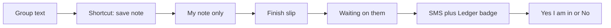

# Note → Finish → Send → Yes / No

**Status:** Planned (refined) — not built yet.  
Canonical product: [`docs/LEDGER_SDD.md`](../LEDGER_SDD.md).  
v1 go-live (Shortcut + Complete as shipped): [`docs/LEDGER_BUILD_SDD.md`](../LEDGER_BUILD_SDD.md).

The group-text Shortcut is only a **note**. It starts a slip. It is not the bet.
The dashboard writes the bet in plain language. SMS and the Ledger badge fire
only when someone taps **Send to [name]** — never on a half-empty capture.

---

## Why the old v1.2/v1.3 write-up was wrong

| Old rule | Bug | Now |
| --- | --- | --- |
| Shortcut picks two seats and locks the proposer | Other person can see or Accept a `$0` empty slip | Note is **draft**. No locks. Only the filer sees it until Send |
| SMS on insert or Complete | Texts “accept” before there is a bet | SMS **only** on Send (stake > 0, two seats, one-line title) |
| Bell = any proposed where your lock is false | Drafts and `$0` notes badge everyone | Bell = **sent to you**, amount &gt; 0, you have not said Yes/No |
| `localStorage` “seen” | Badge returns on the other phone | No seen-store. Badge = live count |
| “Odds” / side A / side B on the card | First-time bettors do not know what that means | **You** vs **Them**. You put in $X. If you win you get $Y. |
| Add bet **and** Complete as two UIs | Same job, two names | One **Finish slip** sheet |
| Join mixed into this “next” | Noise | Join stays v1.1, not this flow |

---

## Three jobs (keep them separate)

1. **Note** — save the group text so it is not forgotten.
2. **Finish + Send** — name the two people and the money in words, then notify.
3. **Yes / No** — the other person agrees or does not. That is the handshake.

Someone who has never bet should only need to read:

> **You** vs **TipsUp**.  
> The bet: Stribling finishes SF WR1.  
> You put in **$100**. If you win you get **$200**.  
> If they win they get **$100**.  
> **Yes, I’m in** · **No**

No “odds”, no “side A”, no “proposed”, no “lock”.

---

## v1.2 — Note, Finish, Send, badge

### Shortcut (thinner)

Share or Copy the message. One tap: **I am** (or remember last seat). Do **not**
pick the other team on the phone.

POST: `raw_text` + `submitted_by` only.

Ingest creates a **draft note**:

- `source_text` / `terms` = the message
- `title` = first line
- `amount_cents` = 0
- `proposer` = you
- `status` = `needs_review` (draft)
- `side_a` = you
- `side_b` = **null** until Finish

**Schema:** allow `side_b` null when `status = needs_review`. Today both sides
are `NOT NULL` and must differ — that is why the live Shortcut asked for two
IDs. Draft notes need a small SQL wave (e.g. wave15) + RLS: only the proposer
can SELECT a draft.

If we ship Finish before that SQL, keep two phone taps but **hide the row from
the other seat until Send**. Same product; worse phone.

### Finish slip (dashboard)

One sheet for a Shortcut note **or** **Add note** (blank, paste optional).

- **You** (fixed = signed-in seat)
- **Them** (chips; cannot be you)
- **What’s the bet?** (one line)
- **You put in $** / **You win $**
- **They put in $** / **They win $**  
  Defaults for even: they put in = you win, they win = you put in
- Quoted group text stays on the card (read-only)

**Send to [name]** blocked unless Them is set, title is non-empty, and
**You put in** &gt; 0.

On Send: fill `side_b`, amounts/odds (store cents; **display** the sentences
above), `status = proposed`, lock **you** only, then SMS (v1.3) + their badge.

### Review (them)

Same sentences with You/Them flipped. **Yes, I’m in** (Accept) / **No** (Decline).
Not the words Accept or Decline on the button.

### Ledger badge

Count of slips **sent to you** (you are the unlocked other party, amount &gt; 0,
`proposed`). Opening the tab does **not** clear it. Yes / No / they Cancel does.
No `localStorage`.

### Deep link

`?tab=ledger` in `setHomeTab` / `syncUrl` so the SMS opens this tab.

Drafts and unsent notes never appear on team-home public Ledger.

---

## v1.3 — SMS (after Send only)

| Rule | Detail |
| --- | --- |
| Phone | Optional in Settings. Not required to Send |
| When | Once per Send, to **Them** only |
| Body | “[Name] wants a $[you put in] bet with you on Chuckle. Open Ledger to say yes or no.” + `?tab=ledger` |
| Skip | No number; duplicate Send; filer |
| No SMS | On note create, on Finish without Send, on Cancel (v1) |
| Identity | Sleeper `user_id`. Phone does not pick sides |

---

## Edge cases

| Case | Behavior |
| --- | --- |
| Two people note the same text | Two drafts (OK). Hash = filer + text, not both sides |
| Send with $0 or no Them | Block. No SMS |
| Wrong Them before Send | Change chip |
| Wrong Them after Send | Cancel and redo (v1) |
| SMS opened while signed in as someone else | CTA; do not Yes the wrong seat |
| Them has no phone | Send still works; badge only |
| They already said Yes | Link shows the open slip, not Yes/No |
| Filer Cancels after SMS | Badge gone. No “cancelled” text (v1) |
| Duplicate Send | No second SMS |
| Same person both sides | Reject |
| Draft on team home | Never listed |
| Join / Open board | Not this flow (v1.1) |

---

## Out of scope this doc pass

- Building Finish / badge / SQL / SMS
- Phone numbers as Shortcut pickers
- PWA push, iMessage, email
