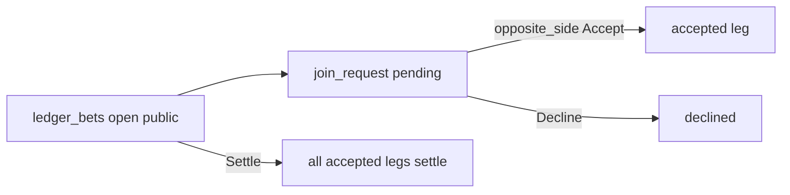

# Join open bets / more exposure

**Status:** Planned (v1.1) — not built yet.  
Canonical product rules: [`docs/LEDGER_SDD.md`](../LEDGER_SDD.md).

---

## Goal

After two parties lock a **public** bet (`status = open`), any other league member
can open that slip, **choose a side**, name a stake, and ask to take the same
proposition. A party on the **opposite** side can Accept (take more exposure) or
Decline.

---

## Product rules (locked)

| Rule | Detail |
| --- | --- |
| Joinable | `status = open` **and** `visibility = public` only |
| Not joinable | Private slips; `proposed` / terminal; already a party on the parent |
| Joiner picks | Side (`side_a` \| `side_b`) + stake (dollars; UI defaults to parent amount) |
| Who Accepts | Any **existing locked party on the opposite side**; v1 first Accept wins |
| Settlement | Accepted joins are **legs** of the parent; same winner/push; W/L sums per leg |
| Discovery | Ledger **Open board** + team-home public cards with **Join** |

---

## User flows

### A. Discover and request

1. Signed-in member opens **Ledger** → **Open board** (or a team-home public `open` card).
2. Taps **Join** on a slip they are not already on.
3. Sheet: pick side A or B, edit stake (default = parent `amount_cents`), confirm.
4. Insert `ledger_join_requests` row `pending`; toast “Waiting on opposite side.”
5. Parent card shows a pending chip for opposite-side parties.

### B. Accept or Decline exposure

1. Opposite-side party sees pending join on **My slips** (parent card).
2. **Accept** → request `accepted`; insert/update leg; event `joined`; exposure totals refresh.
3. **Decline** → request `declined`; event `join_declined`; parent stake unchanged.
4. Concurrent Accept: first writer wins; second is no-op / 409.

### C. Settle

1. Original settle path on parent (I won / They won / Push).
2. All accepted legs inherit that outcome; W/L money = sum of legs per seat.

---

## Schema sketch (future `wave14`)

### `ledger_join_requests`

| Column | Type | Notes |
| --- | --- | --- |
| `id` | uuid PK | |
| `bet_id` | uuid FK → `ledger_bets` | Parent must be `open` + `public` at insert |
| `joiner` | text | Sleeper user id |
| `side` | text | `side_a` \| `side_b` |
| `amount_cents` | int | ≥ 0 |
| `status` | text | `pending` \| `accepted` \| `declined` \| `canceled` |
| `created_at` / `updated_at` | timestamptz | |

### `ledger_bet_legs` (or accept = promote request)

| Column | Type | Notes |
| --- | --- | --- |
| `id` | uuid PK | |
| `bet_id` | uuid FK | |
| `seat` | text | Sleeper user id |
| `side` | text | `side_a` \| `side_b` |
| `amount_cents` | int | |
| `source_request_id` | uuid nullable | FK join request |
| `created_at` | timestamptz | |

On first Accept of an original two-party bet, seed two legs for the original
`side_a` / `side_b` at parent `amount_cents` if not already present, then add the
joiner’s leg.

Parent `amount_cents` remains the original stake for display; **exposure totals**
= sum of accepted legs per side.

### Events

Extend `ledger_bet_events.kind` (or payload) with `join_requested`, `joined`,
`join_declined`, `join_canceled`.

### RLS sketch

- **SELECT parent:** unchanged (member AND party OR public).
- **SELECT requests/legs:** league member if parent public; else party/joiner only.
- **INSERT request:** authenticated member, not already a party, parent `open`+`public`.
- **UPDATE request Accept/Decline:** caller’s seat is opposite side on parent; status `pending`.

---

## UI sketch

| Surface | Behavior |
| --- | --- |
| Ledger → My slips | Existing cards + pending join chips if you are opposite side |
| Ledger → Open board | Public `open` slips you are not on; **Join** |
| Join sheet | Side radios, amount field, Confirm |
| Team home public card | **Join** when not a party |
| Design Mode | Seed one public `open` parent + optional pending join for demo |

---

## Out of scope (v1.1)

- Parimutuel auto-match (no per-join Accept)
- Splitting one join across multiple opposite-side acceptors
- Joining **private** bets
- In-app compose-bet form, Tip Slip skin, Discord ingest

---

## Build order (when implementing)

1. `db/wave14-ledger-join.sql` — tables, RLS, event kinds.
2. App: Open board + Join sheet + Accept/Decline on parent cards.
3. Settlement + team-home W/L include legs.
4. Design Mode seeds; bump `DATA_V` / SW cache.
5. Update [`LEDGER_BUILD_SDD.md`](../LEDGER_BUILD_SDD.md) go-live checklist with wave14.
