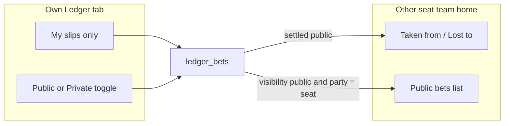

# Ledger privacy + team public view

**Status:** Shipped — my slips only, public/private visibility, team-home public W/L.

Canonical product rules: [`docs/LEDGER_SDD.md`](../LEDGER_SDD.md).

---

# Ledger: my slips, privacy, team public view

## Defaults (locked in)

- **Own Ledger tab:** only bets where you are `side_a` or `side_b`. Remove the **All** filter (league-wide browse goes away).
- **Privacy:** column `visibility` = `'public' | 'private'`, **default `public`**. **Either party** can toggle anytime.
- **Private:** visible only to the two parties (and still actionable for Accept/Settle). Never appears on another seat’s team-home ledger or in anyone else’s lists.
- **Team home:** public W/L money summary (taken from / lost to) **plus** that seat’s public bet list (open + settled; hide declined/canceled noise unless useful).

## Backend

### New migration [`db/wave13-ledger-visibility.sql`](db/wave13-ledger-visibility.sql)

- Add `visibility text not null default 'public' check (visibility in ('public','private'))` to `ledger_bets`.
- Replace SELECT RLS on `ledger_bets` (and align `ledger_bet_events`):

  - Member **and** (`side_a`/`side_b` = caller’s Sleeper seat **or** `visibility = 'public'`).
- Keep UPDATE party-only as today; allow parties to PATCH `visibility`.
- Optional helper RPC later; v1 can PATCH the row like Accept/Settle.

### Ingest [`supabase/functions/ledger-ingest/index.ts`](supabase/functions/ledger-ingest/index.ts)

- Accept optional `visibility` (default `public`).
- Shortcut body may omit it.

### Docs

- Update [`docs/LEDGER_SDD.md`](docs/LEDGER_SDD.md) and [`docs/SUPABASE_SETUP.md`](docs/SUPABASE_SETUP.md) §10: run wave12 **then** wave13; privacy + team-home rules.

## Frontend ([`generate-page.mjs`](generate-page.mjs))

### Own Ledger (`renderLedger` / `ledgerFiltered`)

- Drop **All**; keep **My slips** (or drop the chip row if only one mode).
- Fetch can stay league-scoped; RLS will only return **my bets + other members’ public bets**. Client filter to **my parties only** for this tab so public-but-not-mine never show here.
- Card: **Public / Private** toggle (parties only) → `ledgerPatch` visibility.
- Summary strip: compute from **my** bets only (not league-wide).

### Team home ([`renderTeamHome`](generate-page.mjs) ~10752)

- Ensure `ledgerEnsureLoaded()` when opening a seat.
- New section **Ledger** under partners/drafts:
  - **Taken money from** — settled public bets where this seat won; group/sum by opponent.
  - **Lost money to** — settled public where this seat lost; group/sum by opponent.
  - **Bets lost** — list those losing slips (title, opponent, amount).
  - Below: public open + settled cards for that seat (read-only unless viewer is a party → existing Accept/Settle).
- Private bets involving that seat: **omit** for non-parties; if viewer is a party, show only on **own** Ledger (not necessarily on the other seat’s public team page — keep team page strictly public).

### Design Mode seeds

- Extend `ledgerDesignSeed` with one public settled W/L pair so team-home summary is demoable; keep proposed/open samples.

### Cache

- Bump `DATA_V` + `sw.js` `CACHE` on UI ship.

## Deploy order (after merge)

1. Run `wave12-ledger.sql` if not already.
2. Run `wave13-ledger-visibility.sql`.
3. Redeploy `ledger-ingest` if Shortcut should send visibility.
4. Hard-refresh app; verify My Ledger / Private toggle / other team’s public Ledger.

## Out of scope

- In-app compose-bet form, Tip Slip skin, commissioner force-edit, Discord ingest (unchanged from SDD).
